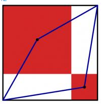
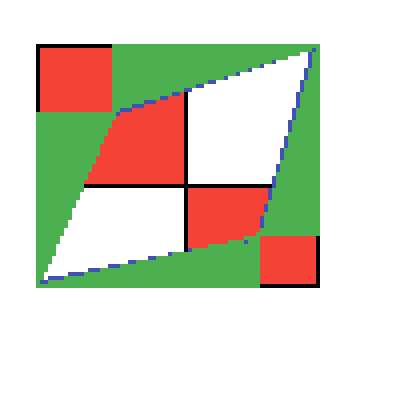

# Description
The diagram to the left shows a large black square. Inside this square, two red squares have been drawn. (The sides of the red squares are parallel to the sides of the black square; each red square shares a vertex with the black square; and the two red squares share a vertex.) A blue quadrilateral has then been drawn with vertices at two corners of the black square and the centres of the red squares.
The area of the blue quadrilateral is 167. What is the area of the black square?



# Workings
Construct 4 triangles around the quadrilateral as follows:



let `s` be the length of the side of the black square.

Let `a` be the distance from the edge of the black square to the centre of the largest red square.

Let `b` be the distance from the edge of the black square to the centre of the smallest red square.

For each red square there are two green triangles that share a vertice with the centre of the square. These are right angle triangles.

The sides of the triangles are:
* `s - a`
* `a`

The area of each triangle is
```
Area = a(s - a) / 2
= (as - a^2) / 2

The sum of the area of the two triangles is (as - a^2)
```

Similarily for the small red square, the combined area of the triangles is:
```
(bs - b^2)
```

The area of the red squares outside the quadrilateral are `a^2` and `b^2`.

The total sum of the area outside the quadrilateral is:

```
(as - a^2) + (bs - b^2) + a^2 + b^2
= as + bs
= s(a + b)
```

`s` can also be defined in terms of `a` and `b`:
```
s = 2a + 2b
```

Therefore,
```
s = 2(a + b)
s / 2 = (a + b)
```

And the area outside the quadrilateral
```
= s(s / 2)
= s^2 / 2
```

But, `s^2` is the area of the black square, so the area outside the quadrilateral is half the area of the square, which means that the area inside the quadrilateral is also half the area of the square.

Therefore, the area of the square is twice the area of the quadrilateral = 334.
