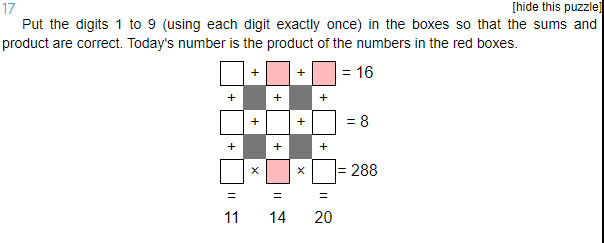

# Description


# Workings
As before, label each box `a` to `i`.

```
a + b + c = 16
d + e + f = 8
g * h * i = 288

a + d + g = 11
b + e + h = 14
c + f + i = 20
```

Start with `g * h * i = 288`.

Prime Factors of 288 = [2, 2, 2, 2, 2, 3, 3]\
Possible triplets of factors = [4, 8, 9]

## Possible Solutions

```
a = [1, 2, 3, 5, 6, 7]
b = [1, 2, 3, 5, 6, 7]
c = [1, 2, 3, 5, 6, 7]
d = [1, 2, 3, 5, 6, 7]
e = [1, 2, 3, 5, 6, 7]
f = [1, 2, 3, 5, 6, 7]
g = [4, 8, 9]
h = [4, 8, 9]
i = [4, 8, 9]

```

`g` can't be 9, because `a + d + g = 11` which would mean both `a` and `d` would have to be 1.

## Possible Solutions

```
a = [1, 2, 3, 5, 6, 7]
b = [1, 2, 3, 5, 6, 7]
c = [1, 2, 3, 5, 6, 7]
d = [1, 2, 3, 5, 6, 7]
e = [1, 2, 3, 5, 6, 7]
f = [1, 2, 3, 5, 6, 7]
g = [4, 8]
h = [4, 8, 9]
i = [4, 8, 9]

```
One of `h` or `i` must be 9.

If `h` = 9, then `b + e = 5`, the only possible combination is `b` = [2, 3], `e` = [2, 3].

If `e` is 3, then `d + f` = 5, which is not possible, as one of them would also need to be 3.

If `e` is 2, then `d + f` = 6, the only possible combination is `d` = [1, 5], `f` = [1, 5].

If `i` = 9, then `c + f = 11`, the possible combinations are `c` = [5, 6], `f` = [5, 6]

If `c` = 5, then `a + b = 11`, which is not possible, because `a` or `b` would have to be 5

If `c` = 6, then `a + b = 10`, the only possible combination is `a` = [3, 7], `b` = [3, 7]

In short:
* If `h` = 9, then `e` = 2 and `b` = 3
* If `i` = 9, then `c` = 6 and `f` = 5
