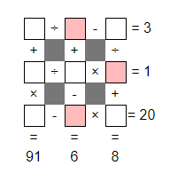

# Description
Put the digits 1 to 9 (using each digit exactly once) in the boxes so that the sums are correct. The sums should be read left to right and top to bottom ignoring the usual order of operations. For example, 4+3×2 is 14, not 10. Today's number is the largest number you can make with the digits in the red boxes



# Workings
I've lost my original workings for this, but the approach is essentially to break the grid down into 9 equations. Label the boxes `a` to `i` and build the equations:

## Across
```
(a / b) - c = 3
(d / e) * f = 1
(g - h) * i = 20
```

## Down
```
(a + d) * g = 91
(b + e) - h = 6
(c / f) + i = 20
```

The obvious place to start is with `(a + d) * g = 91` as 91 has a limited number of factors: 7 & 13, which means that g must be equal to 7. From there it's a matter of substitution and looking at which variables you can limit. It takes a bit of time, but it is doable.

## Notes:
* All numbers are positive.
* Not all parts of an equation have to be integers, e.g. `(3 / 6) * 4` is a reasonable answer.
* You may have to guess a number and follow the chain of logic until the logic fails, or you end up with two or more variables requiring the same answer.
