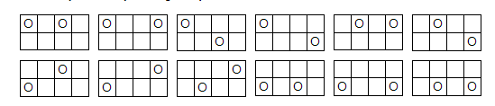

# Description
There are 12 ways of placing 2 tokens on a 2×4 grid so that no two tokens are next to each other horizonally, vertically or diagonally:



Today's number is the number of ways of placing 5 tokens on a 2×10 grid so that no two tokens are next to each other horizonally, vertically or diagonally.

# Workings
2 x 10 array means that each counter has to have the following indices free.

Each occupied cell must have 8 empty cells beside it:
```
 -1   0   +1
+---+---+---+
|   |   |   | -1
+---+---+---+
|   | O |   |  0
+---+---+---+
|   |   |   | +1
+---+---+---+
```
i = row, j = column => Occupied cell = O<sub>ij</sub>

Must be empty (if they exist):\
Cell to the left: O<sub>(i)(j - 1)</sub>\
Cell to the right: O<sub>(i)(j + 1)</sub>\
Cell above: O<sub>(i - 1)(j)</sub>\
Cell below: O<sub>(i + 1)(j)</sub>\
Cell above left: O<sub>(i - 1)(j - 1)</sub>\
Cell above right: O<sub>(i - 1)(j + 1)</sub>\
Cell below left: O<sub>(i + 1)(j - 1)</sub>\
Cell below right: O<sub>(i + 1)(j + 1)</sub>\

As there are only two rows, if the occupied line is the top line and we move up, then we can wrap around to the bottom.

If the occupied line in the bottom row and we want to move down, then we wrap to the top line.

# Brute Force Algorithm
Place first token on the board. Check how may options are left for the second token.\
Place second token in one of the available slots.Check how may options are left for the third token.\
Repeat for tokens 3, 4, & 5.\

Remove all tokens, place the first token in a different position on the board and repeat.
