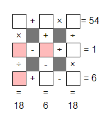

# Description
Put the digits 1 to 9 (using each digit exactly once) in the boxes so that the sums are correct. The sums should be read left to right and top to bottom ignoring the usual order of operations. For example, 4+3×2 is 14, not 10. Today's number is the product of the numbers in the red boxes.



# Workings
This is very similar to the puzzle from Day 3. Unlike that puzzle, we don't have a number with a low number of factors. We do have a couple of equations that have the same result, which might be useful later on.

Also unlike Day 3, I'll try to work this out step by step.

We may not need to solve the entire puzzle, knowing `d`, `e`, and `g` is sufficient.

## Across
```
(a + b) * c = 54
(d - e) / f = 1
(g + h) - i = 6
```

## Down
```
(a * d) / g = 18
(b + e) - h = 6
(c / f) * i = 18
```

## Thoughts
54 has the prime factors 2, 3, 3, 3. Other possible pairs of factors are:

* [2, 27]
* [3, 18]
* [6, 9]

### Variable `c`
* `c` has to be between 1 and 9, so the possible options for c are [2, 3, 6, 9]
* `c` can't be 2, because `(a + b)` would have to be 27, and the largest sum we can have is (8 + 9)
* `c` can be [3, 6, 9]
* `c` can't be 3, for the same reason as it can't be 2
* `c` can be [6, 9]
* `(c / f)` has to be an integer factor of 18, so the possible options are [2, 3, 6, 9]
* if `c` = 6, then `f` could be [1, 2, 3] and `i` can be [3, 6, 9] and `(a + b)` = 9
* if `c` = 9, then `f` has to be 3 and `i` = 6 and `(a + b)` = 6

### Variable `a`
* `(a * d)` must be an integer multiple of 18, i.e. [18, 36, 54, 72] (No bigger multiple can be made with the numbers 1 - 9)
* `(a * d)` can't be 54, because that would require using both 9 and 6, and we know that `c` must be one of those numbers.
* `(a * d)` must be one of [18, 36, 72]
* `a` must be one of [2, 3, 4, 6, 8, 9]
* `d` must be one of [2, 3, 4, 6, 8, 9]
* `(a + b)` is one of [6, 9], so we know that `a` can't be 9, `b` also can't be 9
* `a` must be one of [2, 3, 4, 6, 8]
* `b` must be one of [1, 2, 3, 4, 5, 6, 7, 8]
* `g` must be one of [1, 2, 4]

### Current Possible Solutions
At this stage these are the possible values for each variable

```
a: [2, 3, 4, 6, 8]
b: [1, 2, 3, 4, 5, 6, 7, 8]
c: [6, 9]
d: [2, 3, 4, 6, 8, 9]
e: [1, 2, 3, 4, 5, 6, 7, 8, 9]
f: [1, 2, 3]
g: [1, 2, 4]
h: [1, 2, 3, 4, 5, 6, 7, 8, 9]
i: [3, 6, 9]
```

### Equation `(d - e) / f = 1`
* `(d - e) = f` as `f` must be one of [1, 2, 3], then `(d - e)` must be one of [1, 2, 3]
* `e` cannot be 9, otherwise `(d - e)` would be negative
* `d = f + e`, `f` is one of [1, 2, 3], meaning that d has to be at least 3
* if `d` = 9, `e` can be [6, 7, 8], `f` is one of [1, 2, 3]
* if `d` = 8, `e` can be [5, 6, 7], `f` is one of [1, 2, 3]
* if `d` = 6, `e` can be [3, 4, 5], `f` is one of [1, 2, 3]
* if `d` = 4, `e` can be [1, 2, 3], `f` is one of [1, 2, 3]
* if `d` = 3, `e` can be [1, 2], `f` is one of [1, 2]


### Current Possible Solutions
At this stage these are the possible values for each variable

```
a: [2, 3, 4, 6, 8]
b: [1, 2, 3, 4, 5, 6, 7, 8]
c: [6, 9]
d: [3, 4, 6, 8, 9]
e: [1, 2, 3, 4, 5, 6, 7, 8]
f: [1, 2, 3]
g: [1, 2, 4]
h: [1, 2, 3, 4, 5, 6, 7, 8, 9]
i: [3, 6, 9]
```

### Equation `(b + e) - h = 6`
* `(b + e)` must be > 6.

### Equation `(g + h) - i = 6`
* `(g + h)` must be > 6

## Solution attempt 1: `c` = 9
Assume that c = 9, what does that give us? From above, we know now that `f` = 3 and `i` = 6, and `(a + b) = 6` so `a` has to be >= 5.

```
(a + b) * 9 = 54
(d - e) / 3 = 1
(g + h) - 6 = 6

(a * d) / g = 18
(b + e) - h = 6
(9 / 3) * 6 = 18

a: [2, 4]
b: [1, 2, 4, 5, 7, 8]
c: 9
d: [4, 8]
e: [1, 2, 4, 5, 7, 8]
f: 3
g: [1, 2, 4]
h: [1, 2, 4, 5, 7, 8]
i: 6
```

At this point, the possible solutions for `a` are [2, 4] and the possible solutions for `d` are [4, 8], we also know that `(a * d)` is a multiple of 18, and here's where the logic breaks, because there is no way to make 18 using the available factors. So we know, that `c` must be 6.

## Solution attempt 2: `c` = 6
With `c` now equal to 6:

```
(a + b) * 6 = 54
(d - e) / f = 1
(g + h) - i = 6

(a * d) / g = 18
(b + e) - h = 6
(6 / f) * i = 18

a: [2, 3, 4, 8]
b: [1, 2, 3, 4, 5, 7, 8]
c: 6
d: [3, 4, 8, 9]
e: [1, 2, 3, 4, 5, 7, 8]
f: [1, 2, 3]
g: [1, 2, 4]
h: [1, 2, 3, 4, 5, 7, 8, 9]
i: [3, 9]
```

* `c` = 6 means that `f` cannot be 2, as that would require `i` to be also 6.

### Current Possible Solutions

```
a: [2, 3, 4, 8]
b: [1, 2, 3, 4, 5, 7, 8]
c: 6
d: [3, 4, 8, 9]
e: [1, 2, 3, 4, 5, 7, 8]
f: [1, 3]
g: [1, 2, 4]
h: [1, 2, 3, 4, 5, 7, 8, 9]
i: [3, 9]
```

* We know that `(a + b)` = 9, neither `a` or `b` can be 6, so neither can be 3
* `a` can be one of [2, 4, 8], `b` can therefore be one of [1, 5, 7]
* `(a * d)` must be a multiple of 18, meaning that d must be 9.

### Current Possible Solutions
With `d` = 9:

```
(a + b) * 6 = 54
(9 - e) / f = 1
(g + h) - i = 6

(a * 9) / g = 18
(b + e) - h = 6
(6 / f) * i = 18

a: [2, 4, 8]
b: [1, 5, 7]
c: 6
d: 9
e: [1, 2, 3, 4, 5, 7, 8]
f: [1, 3]
g: [1, 2, 4]
h: [1, 2, 3, 4, 5, 7, 8]
i: 3
```

* `i` can now only be 3

### Current Possible Solutions
With `i` = 3:

```
(a + b) * 6 = 54
(9 - e) / f = 1
(g + h) - 3 = 6

(a * 9) / g = 18
(b + e) - h = 6
(6 / f) * 3 = 18

a: [2, 4, 8]
b: [1, 5, 7]
c: 6
d: 9
e: [1, 2, 4, 5, 7, 8]
f: 1
g: [1, 2, 4]
h: [1, 2, 3, 4, 5, 7, 8]
i: 3
```

* `f` must be = 1

### Current Possible Solutions
With `f` = 1:

```
(a + b) * 6 = 54
(9 - e) / 1 = 1
(g + h) - 3 = 6

(a * 9) / g = 18
(b + e) - h = 6
(6 / 1) * 3 = 18

a: [2, 4, 8]
b: [5, 7]
c: 6
d: 9
e: [2, 4, 5, 7, 8]
f: 1
g: [2, 4]
h: [2, 3, 4, 5, 7, 8]
i: 3
```

* `e` must be equal to 8

### Current Possible Solutions
With `e` = 8:

```
(a + b) * 6 = 54
(9 - 8) / 1 = 1
(g + h) - 3 = 6

(a * 9) / g = 18
(b + 8) - h = 6
(6 / 1) * 3 = 18

a: [2, 4]
b: [5, 7]
c: 6
d: 9
e: 8
f: 1
g: [2, 4]
h: [2, 3, 4, 5, 7]
i: 3
```

* `b` is one of [5, 7], which means that `h` must be one of [7, 9], as `h` can't be 9, then `b` = 5 and `h` = 7

### Current Possible Solutions
With `b` = 5, `h` = 7:

```
(a + 5) * 6 = 54
(9 - 8) / 1 = 1
(g + 7) - 3 = 6

(a * 9) / g = 18
(5 + 8) - 7 = 6
(6 / 1) * 3 = 18

a: [2, 4]
b: 5
c: 6
d: 9
e: 8
f: 1
g: [2, 4]
h: 7
i: 3
```

* `a` must be 4, `g` must be 2

### Solution
With `a` = 4, `g` = 2:

```
(4 + 5) * 6 = 54
(9 - 8) / 1 = 1
(2 + 7) - 3 = 6

(4 * 9) / 2 = 18
(5 + 8) - 7 = 6
(6 / 1) * 3 = 18

a: 4
b: 5
c: 6
d: 9
e: 8
f: 1
g: 2
h: 7
i: 3
```

* The answer to the puzzle is `d * e * g` = 9 * 8 * 2 = 144
