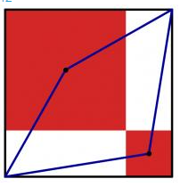

# Description
The diagram to the left shows a large black square. Inside this square, two red squares have been drawn. (The sides of the red squares are parallel to the sides of the black square; each red square shares a vertex with the black square; and the two red squares share a vertex.) A blue quadrilateral has then been drawn with vertices at two corners of the black square and the centres of the red squares.
The area of the blue quadrilateral is 167. What is the area of the black square?

