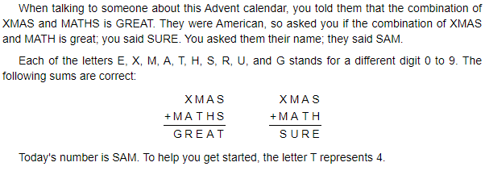

# Description


# Workings
I hate these type of puzzles... but we'll give it a go.

```
    X M A S
+ M A T H S
------------
  G R E A T

  X M A S
+ M A T H
-----------
  S U R E
```

Need to solve for S A M.

## Notes
Each letter represents a single digit from 0 - 9.\
The largest sum we can have is 9 + 9 = 18.\
The largest carry we can have is 1.

The 10 individual letters are:
* X M A S T H G R E U


```
T = 4

    X M A S
+ M A 4 H S
------------
  G R E A 4

  X M A S
+ M A 4 H
-----------
  S U R E
```

We can see that S + S = 4, that means that S = 2 or 7. (We could be carrying a 1)

We can also see that A + H = A, the only way this works is if H = 10, but that can't be the case, so H must be 9, and S + S must carry a 1. So now we have:

```
S = 7
H = 9

    X M A 7
+ M A 4 9 7
------------
  G R E A 4

  X M A 7
+ M A 4 9
-----------
  7 U R E
```

We now know that E = 6.

```
E = 6

    X M A 7
+ M A 4 9 7
------------
  G R 6 A 4

  X M A 7
+ M A 4 9
-----------
  7 U R 6
```

From the first sum, we can see that M + 4 + 1 = 6. (There's a carry from the previous step). M + 4 + 1 = 16 is not valid as that would require M to be > 9. M = 1.

```
M = 1

    X 1 A 7
+ 1 A 4 9 7
------------
  G R 6 A 4

  X 1 A 7
+ 1 A 4 9
-----------
  7 U R 6
```

As the largest carry we can have is 1, we can see from the first sum that G is out on its own, so G must be 2.

```
G = 2

    X 1 A 7
+ 1 A 4 9 7
------------
  2 R 6 A 4

  X 1 A 7
+ 1 A 4 9
-----------
  7 U R 6
```

Current solution:

```
X =
M = 1
A =
S = 7
T = 4
H = 9
G = 2
R =
E = 6
U =

Remaining numbers: 0, 3, 5, 8
```

From the second sum we can see that X + 1 = 7 or X + 1 + 1 = 7. (There may be a carry from the previou step.)

The only remaining number that fills either of these requirements is 5, with a carry from the previous step.

```
X = 2

    5 1 A 7
+ 1 A 4 9 7
------------
  2 R 6 A 4

  5 1 A 7
+ 1 A 4 9
-----------
  7 U R 6

Remaining numbers: 0, 3, 8
```

From the first sum, we can see that 5 + A = R and that 5 + A > 10. The only remaining number that fills that critera is 8.

```
A = 8

    5 1 8 7
+ 1 8 4 9 7
------------
  2 R 6 8 4

  5 1 8 7
+ 1 8 4 9
-----------
  7 U R 6

Remaining numbers: 0, 3
```

We now have 2 complete sums, so we can check:

```
    5 1 8 7
+ 1 8 4 9 7
------------
  2 3 6 8 4

  5 1 8 7
+ 1 8 4 9
-----------
  7 0 3 6

R = 3
U = 0
```

There for SAM = 781.
