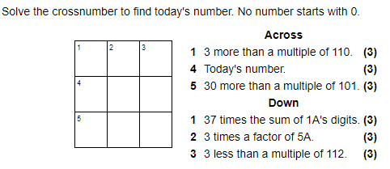

# Description


# Workings

## 1 Across
Possible answers: [113, 223, 333, 443, 553, 663, 773, 883, 993]
Every possible answer ends in a 3.

## 5 Across
Possible answers: [131, 232, 333, 434, 535, 636, 737, 838, 939]
Every possible answer has a 3 as the second digit

## Current Solution

```
+---+---+---+
|   |   | 3 |
+---+---+---+
|   |   |   |
+---+---+---+
|   | 3 |   |
+---+---+---+
```

## 3 Down
Starts with a 3. The only possible multiple of 112 starting with 3 is 336.
Answer: 333


## Current Solution

```
+---+---+---+
|   |   | 3 |
+---+---+---+
|   |   | 3 |
+---+---+---+
|   | 3 | 3 |
+---+---+---+
```

## 5 Across
Last two digits are 33, so the only answer is 333.

## Current Solution

```
+---+---+---+
|   |   | 3 |
+---+---+---+
|   |   | 3 |
+---+---+---+
| 3 | 3 | 3 |
+---+---+---+
```

## 2 Down
5 Across = 333. The prime factors of 333 are: 3, 3, 37. Unique factors of 333 are 1, 3, 9, 37, 111, 333.

Possible solutions:
* 3 * 37 = 111
* 3 * 111 = 333
* 3 * 333 = 999

2 Down ends in a 3, so the answer is 333.

## Current Solution

```
+---+---+---+
|   | 3 | 3 |
+---+---+---+
|   | 3 | 3 |
+---+---+---+
| 3 | 3 | 3 |
+---+---+---+
```

## 1 Across
Answer ends in 33, so the full answer is 333.

## Current Solution

```
+---+---+---+
| 3 | 3 | 3 |
+---+---+---+
|   | 3 | 3 |
+---+---+---+
| 3 | 3 | 3 |
+---+---+---+
```

## 1 Down
37 * (3 + 3 +3) = 333. Funny that!

# Solution
```
+---+---+---+
| 3 | 3 | 3 |
+---+---+---+
| 3 | 3 | 3 |
+---+---+---+
| 3 | 3 | 3 |
+---+---+---+
```
