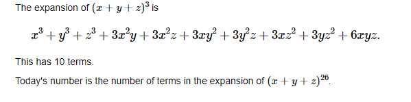
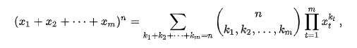
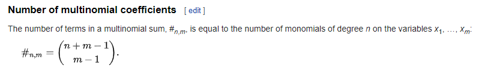

# Description


# Workings
The [Binomial Theorem](https://en.wikipedia.org/wiki/Binomial_theorem) can be used to expand algebraic expressions with 2 terms, i.e. (x + y)<sup>n</sup>

This has three terms, so we need the [Multinomial Theorem](https://en.wikipedia.org/wiki/Multinomial_theorem), which is a generalisation of the Binomial Theorem.




Fortunately, we don't have to expand out the entire expression, we can calculate the number of coefficients from:



Here, m = 3 and n = 26.

So the total is
```
+-  -+
| 28 |  == 28C2 = 378
| 2  |
+-  -+
```
