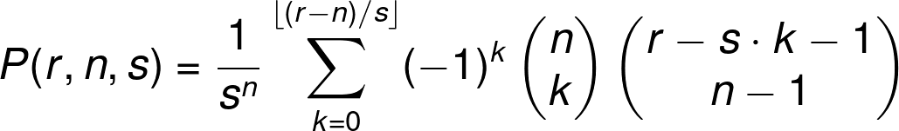

# Description
Carol rolled a large handful of six-sided dice. The total of all the numbers Carol got was 521.
After some calculating, Carol worked out that the probability that of her total being 521 was the same as the probability that her total being 200.
How many dice did Carol roll?

# Workings
Probability of rolling 10 with 2 dice is:

Ways of rolling 10: [4, 6], [5, 5], [6, 4]\
Number of possible outcomes: 36\
Probability: 3/36 = 0.0833

If the probability of rolling 521 and 200 is the same, then the number of ways to roll those numbers are the same: Call it X. Number of dice = N

To roll 521, you need at least Math.ceil(521 / 6) = 87 dice. This sets the absolute lower bound, however we also know that the answer has at 3 digits
so the lower bound is actually 100.

The upper bound is 200, because any more dice than that and it's not possible to roll 200.

So for each number of dice between 100 and 200, we have to calculate the probability of rolling 521 and 200.

The number of possible outcomes = 6 ^ N where N is the number of dice. For 200 dice this is a huge number and needs to be represented as a BigInt.

```
BigInt(Math.pow(6, 200)) = 426825223812027418890822638940363656845648276125323888998923834808612716932857614130884809238924869437532348038131987282955125485318424988074770692583718912n

BigInt(Math.pow(6, 200)) = 653318623500070897423596169561540920217390783243900597935846601233315745759232n
```

[The formula for calculating the necessary probability is](https://www.omnicalculator.com/statistics/dice#how-to-calculate-dice-roll-probability):



Some of the terms in this formula are explained [here](https://www.mathsisfun.com/combinatorics/combinations-permutations.html).

We have values for everything here:

r = 521 or 200\
100 >= n <= 200\
s = 6

As we're looking for the number of dice, we dont need the actual probability, so we can drop the first part of the formula (1 / s ^ n) as it's a constant and concentrate just on the rest of the sum.
