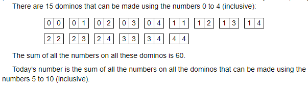

# Description


# Workings
Using numbers 0 - 4 results in 15 dominos. 15 is 2<sup>4</sup> - 1. Could be coincidental...

If we look at the first number on the dominos:

First Digit|Number of Dominos
--|--
0|5
1|4
2|3
3|2
4|1

This looks like a triangular number... [formula](https://www.mathsisfun.com/algebra/triangular-numbers.html) for a triangular number is:

```
T(n) = n(n + 1) / 2
```

The largest number on a domino is 4, but we're using [zero-indexing](https://en.wikipedia.org/wiki/Zero-based_numbering), so it's the 5th triangular number we need.

```
T(5) = (5)(6) / 2 = 15
```

This approach seems to be a better fit than using 2<sup>4</sup> - 1.

If we look at how many times each digit appears in the first and second position on the dominos:

Digit|Appears in First|Appears in Second|Total Appearances
--|--|--|--
0|5|1|6
1|4|2|6
2|3|3|6
3|2|4|6
4|1|5|6

So the sum is:
```
6(0 + 1 + 2 + 3 + 4) = 60
```

We can build a similar table for the dominos from 5 to 10 using the same pattern:

Digit|Appears in First|Appears in Second|Total Appearances
--|--|--|--
5|6|1|7
6|5|2|7
7|4|3|7
8|3|4|7
9|2|5|7
10|1|6|7

So the sum is:
```
7(5 + 6 + 7 + 8 + 9 + 10) = 315
```

# Brute force approach
Create an array that holds all the dominos, and sum the contents. The array will look something like:

```
[
    [5, 5], [5, 6], [5, 7]...
    [6, 6], [6, 7]...
]
```
